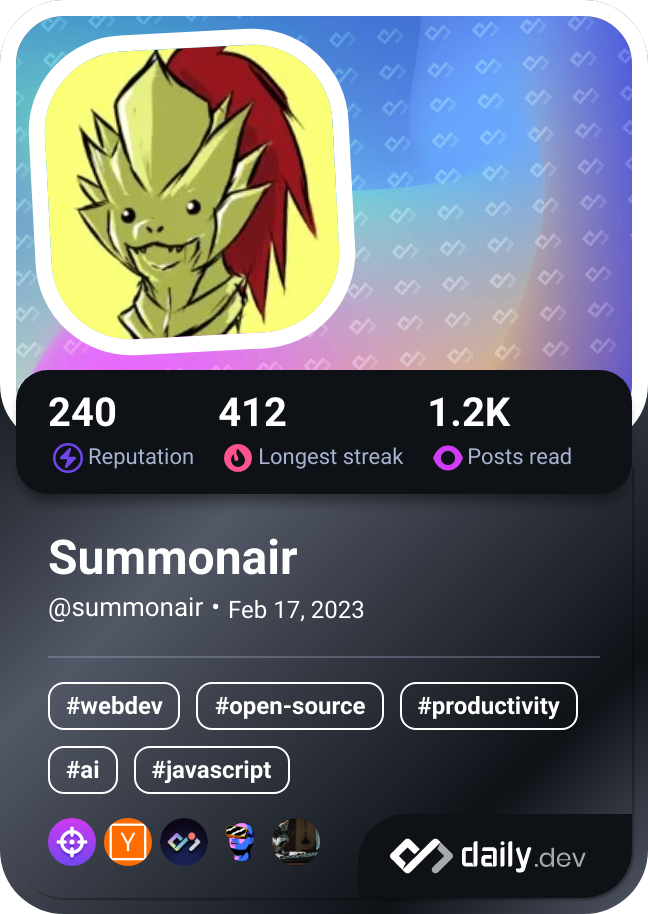

Hi 👋 My name is Tal Balash
===========================

I turn coffee into shiny apps and websites
---------------------------------------------

i've been learning to code since middle school, i started from investigating minecraft mods and ended up coding. I love developing mobile apps & games, websites, scrips, bots, automations and everything else that whispers sweet promises of bug fixes and endless cups of cold brew 🧊☕

* 🌍  I'm based somewhere in israel
* ✉️  You can contact me at [tal.balash+dev@gmail.com](mailto:tal.balash+dev@gmail.com)
* 🧠  I'm currently learning flutter & unity 3d

# 💻 Tech Stack

# 🔁 Devops Stack
  

# ⚡ Just For Fun

<!--

 
 

**Summonair/Summonair** is a ✨ _special_ ✨ repository because its `README.md` (this file) appears on your GitHub profile.

Here are some ideas to get you started:

- 🔭 I’m currently working on ...
- 🌱 I’m currently learning ...
- 👯 I’m looking to collaborate on ...
- 🤔 I’m looking for help with ...
- 💬 Ask me about ...
- 📫 How to reach me: ...
- 😄 Pronouns: ...
- ⚡ Fun fact: ...
-->
